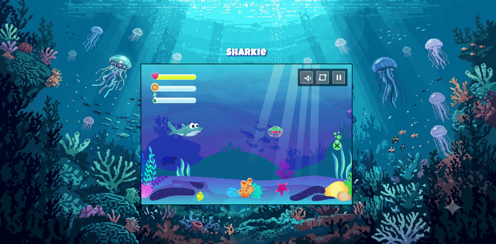

# 🦈 Sharkie

**A browser-based 2D underwater adventure game built with vanilla JavaScript and the HTML5 Canvas API.**

Guide Sharkie through the ocean, collect coins and poison bottles, defeat dangerous jellyfish and face a powerful final boss. The game was built from scratch without frameworks, external libraries, a game engine or build tools.

## ▶️ Play live

**[Start the Sharkie live demo](https://tobiasillner.developerakademie.net/sharkie/index.html)**

## 🎥 Gameplay preview



## 🎮 About the game

Sharkie is a side-scrolling underwater game in which the player explores a long ocean level filled with enemies and collectibles. Normal bubbles can be used for regular attacks, while collected poison bottles unlock stronger poison bubbles. At the end of the level, Sharkie must survive an animated boss fight to win the game.

The project was created during my further training as a Fullstack Developer at the **Developer Akademie**. It focuses on object-oriented JavaScript, sprite animation, collision detection, game-state management and responsive controls for desktop and mobile devices.

## ✨ Features

- 🦈 Animated player character with idle, swimming, sleeping, attacking, hurt and death states
- 🩼 Four different animated jellyfish enemy variants
- 🐋 Final boss with spawn, chase, attack, hurt and death behavior
- 🫧 Normal bubble attacks
- ☠️ Stronger poison bubble attacks that consume collected poison bottles
- 🪙 Collectible coins and poison bottles
- ❤️ Status bars for health, coins, poison bottles and boss health
- 🎲 Randomized enemy and collectible positions on every new game
- 🌊 Side-scrolling underwater world with camera movement
- 💥 Collision detection for the player, enemies, projectiles and collectibles
- 🔊 Background music and multiple sound effects
- 🔇 Mute control and adjustable volume
- 💾 Persistent sound settings using Local Storage
- ⏸️ Pause menu with resume, restart and main-menu actions
- 🏆 Win and game-over screens with replay options
- 📖 Integrated tutorial, settings and legal-notice overlays
- 📱 Responsive layout with mobile touch controls
- 🔄 Portrait-mode warning for mobile devices
- 🖥️ Fullscreen mode
- ⏳ Asset preloading with a visual loading indicator

## ⌨️ Controls

| Action | Keyboard |
| --- | --- |
| Swim | Arrow keys or `W` `A` `S` `D` |
| Normal bubble attack | `Space` |
| Poison bubble attack | `E` |
| Pause or resume | `Escape` |

On supported touch devices, on-screen movement and attack controls appear automatically while playing.

## 🛠️ Tech stack

- **Vanilla JavaScript** with ES6 classes
- **Object-oriented programming** with inheritance and reusable base classes
- **HTML5 Canvas API** for rendering the game world and interface
- **HTML5** for the application structure
- **CSS3** with media queries for responsive and mobile layouts
- **Pointer Events** for multi-touch controls
- **Web Audio** for music and sound effects
- **Local Storage** for saved audio settings
- **JSDoc** for class and method documentation

No package manager, framework, game engine or build process is required.

## 🧱 Architecture

The game uses an object-oriented class hierarchy. Shared drawing, movement and collision behavior is inherited by the individual game objects:

```text
DrawableObject
├── MovableObject
│   ├── Character
│   ├── JellyFish
│   │   ├── JellyFishYellow
│   │   ├── JellyFishPurple
│   │   ├── JellyFishPink
│   │   └── JellyFishGreen
│   ├── Endboss
│   ├── ThrowableObject
│   │   └── SpecialBubble
│   ├── BackgroundObject
│   └── Light
├── CollectibleObject
│   ├── Coin
│   └── Bottle
└── StatusBar
    ├── StatusBarLife
    ├── StatusBarCoin
    ├── StatusBarPosion
    └── StatusBarBoss
```

Important supporting classes include:

- `World` coordinates game state, attacks, collisions, collectibles and the boss fight
- `WorldRenderer` draws the canvas layers, status bars and camera-based game world
- `Level` stores enemies, backgrounds, lights, collectibles and level boundaries
- `SoundManager` controls background music, effects, volume and mute state
- `Keyboard` stores the current keyboard and touch input state
- `UIControls` renders and handles in-game sound, fullscreen and pause buttons
- `StartScreen` and its renderer classes provide the menu, tutorial, settings and legal notice
- `EndScreen` renders the win and game-over interfaces

A visual class diagram is available in [`draw.drawio`](./draw.drawio) and can be opened with [draw.io](https://app.diagrams.net/).

## 📁 Project structure

```text
sharkie/
├── index.html          # Game entry point and canvas
├── style.css          # Desktop, responsive and touch styles
├── classes/           # Game objects, screens, rendering and managers
├── js/                # Bootstrap, input, audio, assets and game state
├── assets/
│   ├── fonts/         # Local game font
│   ├── img/           # Sprites, backgrounds and interface graphics
│   ├── level/         # Level generation and configuration
│   └── sounds/        # Music and sound effects
└── draw.drawio        # Class diagram
```

## 🚀 Getting started

The project consists of static HTML, CSS and JavaScript files, so no installation or build step is needed.

1. Clone the repository:

   ```bash
   git clone https://github.com/TobiasIllnerDev/Sharkie.git
   ```

2. Open the project directory:

   ```bash
   cd Sharkie
   ```

3. Open `index.html` in a browser.

For the best local development experience, serve the directory with a static development server such as the VS Code **Live Server** extension.

## 🧠 What I learned

This project provided practical experience with:

- Designing an object-oriented class hierarchy in JavaScript
- Building a rendering and animation loop with HTML5 Canvas
- Coordinating movement, sprite animations and camera scrolling
- Implementing collision detection and different damage types
- Managing game states such as loading, playing, paused, won and lost
- Creating enemy AI and a multi-state boss fight
- Handling keyboard, pointer and multi-touch input
- Managing several sound effects and persistent audio settings
- Refactoring game logic into focused classes and modules
- Building a responsive browser game without external frameworks

## 👤 Author

Created by **Tobias Illner** as a portfolio project during further training as a Fullstack Developer at the **Developer Akademie**.

- GitHub: [@TobiasIllnerDev](https://github.com/TobiasIllnerDev)

## 📜 Credits

This is a non-commercial educational portfolio project. The visual and audio assets used in the game were provided or licensed by the **Developer Akademie** for use within the training project. All associated rights remain with their respective creators and rights holders.
